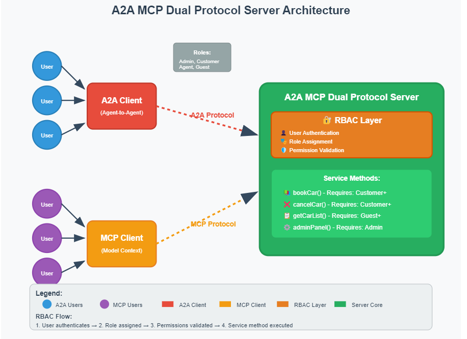

# A2A and MCP Security Integration with Spring

This project demonstrates how to secure your Agent-to-Agent (A2A) and Model Context Protocol (MCP) server using Spring Security. It provides a seamless integration between A2A Java's agent framework and Spring's robust security mechanisms.

## Overview

[A2A Java](https://github.com/vishalmysore/a2ajava) is a powerful framework for building agent-based systems, while MCP (Model Context Protocol) enables interaction with various AI models. This project showcases how to:

1. Secure agent actions with role-based access control
2. Integrate Spring Security with A2A Java annotations
3. Handle authentication for both human users and AI agents



## Features

- Role-based access control (USER and ADMIN roles)
- Annotation-based security (@PreAuthorize)
- Seamless integration with existing A2A Java agents
- Support for multiple client implementations (Python, Java)
- servers starts on 7860 you can change it to 8080 in the application.properties file


@Log
@Service
@Agent(groupName = "car booking", groupDescription = "actions related to car booking")
public class CarBookingAgent {

    @PreAuthorize("hasRole('USER')")
    @Action(description = "Book a car for the given details")
    public String bookCar(String carType, String pickupLocation, String dropLocation) {
        log.info("Booking car of type: " + carType+
                ", pickup location: " + pickupLocation +
                ", drop location: " + dropLocation);
        return "Car of type " + carType + " has been booked from " + pickupLocation + " to " + dropLocation;
    }
    @PreAuthorize("hasRole('ADMIN')")
    @Action(description = "Cancel a car booking")
    public String cancelCarBooking(String bookingId) {
        log.info("Cancelling car booking with ID: " + bookingId);
        return "Car booking with ID " + bookingId + " has been cancelled";
    }
    //this action is public and does not require any role
    @Action(description = "get status of booking")
    public String getBookingStatus(String bookingId) {
        return "The status of booking ID " + bookingId + " is confirmed";
    }
}
## Test A2A Client

Lets test how the agent cards are exposed to the clients based on thieir roles.

Test with a user role

```bash
curl -u user:password http://localhost:7860/.well-known/agent.json 
```

will give you only these actions 

```json
{"name":"Car Booking Agent","description":"This agent provides capabilities for car booking, allowing users to book cars, check booking status, view available car types, and get pricing information.","url":"http://vishal:7860","provider":{"organization":"Car Rentals Inc.","url":"https://example.com"},"version":"1.0.0","documentationUrl":"https://example.com/docs/car-booking-agent","capabilities":{"streaming":true,"pushNotifications":true,"stateTransitionHistory":true},"authentication":{"schemes":["ApiKey"],"credentials":"Basic","valid":true,"bearerAuth":false,"basicAuth":false},"defaultInputModes":["Text","Voice"],"defaultOutputModes":["Text","Voice"],"skills":[{"id":"bookCar","name":"Book Car","description":"Allows users to book a car from the available options.","tags":["booking","car rental","transportation"],"examples":["Book a sedan for tomorrow","Reserve an SUV for the weekend"],"inputModes":["Text","Voice"],"outputModes":["Text","Voice"]},{"id":"getBookingStatus","name":"Get Booking Status","description":"Allows users to check the status of their car bookings.","tags":["status","booking"],"examples":["What is the status of my booking?","Check booking status for today"],"inputModes":["Text","Voice"],"outputModes":["Text","Voice"]},{"id":"listCarTypes","name":"List Car Types","description":"Provides a list of available car types for booking.","tags":["list","car types","available cars"],"examples":["What car types are available?","Show me the list of cars"],"inputModes":["Text","Voice"],"outputModes":["Text","Voice"]},{"id":"getCarPricing","name":"Get Car Pricing","description":"Provides pricing information for different car types.","tags":["pricing","cost","car rental"],"examples":["What is the price for a sedan?","How much does it cost to rent an SUV?"],"inputModes":["Text","Voice"],"outputModes":["Text","Voice"]}]}

```

Test without a role

``` 
curl http://localhost:7860/.well-known/agent.json
```

```json
 {"name":"Car Booking Agent","description":"This agent provides capabilities related to booking cars, checking booking status, listing car types, and retrieving car pricing.","url":"http://vishal:7860","provider":{"organization":"Car Rentals Inc.","url":"https://example.com"},"version":"1.0.0","documentationUrl":"https://example.com/docs/car-booking-agent","capabilities":{"streaming":true,"pushNotifications":true,"stateTransitionHistory":false},"authentication":{"schemes":["ApiKey"],"credentials":"Basic","valid":true,"bearerAuth":false,"basicAuth":false},"defaultInputModes":["text","voice"],"defaultOutputModes":["text","voice"],"skills":[{"id":"car_booking","name":"Car Booking","description":"Allows users to book cars, check booking status, and retrieve pricing information.","tags":["car","booking","transportation"],"examples":["Book a sedan from the airport","Check the status of my booking","List available SUVs","Get pricing for a compact car"],"inputModes":["text","voice"],"outputModes":["text","voice"]}]}
```

Test with admin role


```bash
curl -u admin:admin http://localhost:7860/.well-known/agent.json
```

```json
 {"name":"Car Booking Agent","description":"This agent provides capabilities related to car booking, including booking management and status tracking.","url":"http://vishal:7860","provider":{"organization":"Car Rentals Inc.","url":"https://example.com"},"version":"1.0.0","documentationUrl":"https://example.com/documentation","capabilities":{"streaming":true,"pushNotifications":true,"stateTransitionHistory":true},"authentication":{"schemes":["ApiKey"],"credentials":"Basic","valid":true,"bearerAuth":false,"basicAuth":false},"defaultInputModes":["text","voice"],"defaultOutputModes":["text","voice"],"skills":[{"id":"carBooking","name":"Car Booking Management","description":"Manage car bookings including creation, cancellation, and status checks.","tags":["booking","car","management"],"examples":["Book a car for tomorrow","Cancel my booking","What is the status of my booking?"],"inputModes":["text","voice"],"outputModes":["text","voice"]},{"id":"getBookingStatus","name":"Get Booking Status","description":"Check the current status of a car booking.","tags":["status","booking"],"examples":["What is the status of my booking?","Is my car ready for pickup?"],"inputModes":["text","voice"],"outputModes":["text","voice"]},{"id":"listCarTypes","name":"List Car Types","description":"Retrieve a list of available car types for booking.","tags":["car types","listing"],"examples":["What car types do you have?","List the available cars for today."],"inputModes":["text","voice"],"outputModes":["text","voice"]},{"id":"getCarPricing","name":"Get Car Pricing","description":"Fetch the pricing information for different car types.","tags":["pricing","car"],"examples":["What is the price for a sedan?","How much does it cost to rent an SUV?"],"inputModes":["text","voice"],"outputModes":["text","voice"]},{"id":"cancelCarBooking","name":"Cancel Car Booking","description":"Cancel an existing car booking.","tags":["cancellation","booking"],"examples":["Cancel my booking for tomorrow.","I want to cancel my reservation."],"inputModes":["text","voice"],"outputModes":["text","voice"]},{"id":"blockCarForMaintenance","name":"Block Car for Maintenance","description":"Block a car for maintenance to prevent bookings.","tags":["maintenance","blocking"],"examples":["Block a car for maintenance.","Put this car on hold for servicing."],"inputModes":["text","voice"],"outputModes":["text","voice"]},{"id":"generateBookingReport","name":"Generate Booking Report","description":"Generate a report of bookings for analysis.","tags":["reporting","booking"],"examples":["Generate a report of all bookings for the week.","Show me the booking report for this month."],"inputModes":["text","voice"],"outputModes":["text","voice"]}]}
```


Call Too from A2a Client

```bash 
curl -v -u user:password \
  -H "Content-Type: application/json" \
  -d '{
    "jsonrpc": "2.0",
    "method": "tasks/send",
    "params": {
      "id": "0e2fc442-180f-4cd2-b316-08b384bb236f",
      "sessionId": "fbe485db-c295-40d0-bb9c-bb16367df091",
      "message": {
        "role": "user",
        "parts": [
          {
            "type": "text",
            "text": "book a maruti car from tornot to vanquer on 22 may 2025",
            "metadata": null
          }
        ],
        "metadata": {
          "conversation_id": "fbe485db-c295-40d0-bb9c-bb16367df091",
          "conversation_name": "",
          "message_id": "e3749782-bc89-4691-b6cc-77239fef1ad0",
          "last_message_id": "122350f4-6ce7-436f-8ca4-0557b75b15ea"
        }
      },
      "acceptedOutputModes": ["text", "text/plain", "image/png"],
      "pushNotification": null,
      "historyLength": null,
      "metadata": {
        "conversation_id": "fbe485db-c295-40d0-bb9c-bb16367df091"
      }
    },
    "id": "d0ed3aa440f64d63a3a73d2bc7eb6358"
  }' \
  http://localhost:7860/
```

Result 

```json 
{"jsonrpc":"2.0","id":"0e2fc442-180f-4cd2-b316-08b384bb236f","result":{"id":"0e2fc442-180f-4cd2-b316-08b384bb236f","sessionId":"fbe485db-c295-40d0-bb9c-bb16367df091","status":{"state":"submitted","message":null,"timestamp":"2025-05-23T21:07:55.790141400Z"},"history":[{"role":"user","parts":[{"type":"text","type":"text","metadata":null,"text":"book a maruti car from tornot to vanquer on 22 may 2025"}],"metadata":{"conversation_id":"fbe485db-c295-40d0-bb9c-bb16367df091","conversation_name":"","message_id":"e3749782-bc89-4691-b6cc-77239fef1ad0","last_message_id":"122350f4-6ce7-436f-8ca4-0557b75b15ea"}},{"role":"user","parts":[{"type":"text","type":"text","metadata":null,"text":"book a maruti car from tornot to vanquer on 22 may 2025"}],"metadata":{"conversation_id":"fbe485db-c295-40d0-bb9c-bb16367df091","conversation_name":"","message_id":"e3749782-bc89-4691-b6cc-77239fef1ad0","last_message_id":"122350f4-6ce7-436f-8ca4-0557b75b15ea"}}],"artifacts":null,"metadata":null,"pushNotificationConfig":null,"pushNotificationUrl":null,"subscribed":false,"subscriptionDateNow":null,"cancelled":false},"error":null}
```

but when you call with different username and password you will get access denied

``` 
{"jsonrpc":"2.0","id":"0e2fc442-180f-4cd2-b316-08b384bb236f","result":{"id":"0e2fc442-180f-4cd2-b316-08b384bb236f","sessionId":"fbe485db-c295-40d0-bb9c-bb16367df091","status":{"state":"failed","message":{"role":"agent","parts":[{"type":"text","type":"text","metadata":{},"text":"Processing failed: Access Denied"}],"metadata":null},"timestamp":"2025-05-23T21:27:06.172634900Z"},"history":[{"role":"user","parts":[{"type":"text","type":"text","metadata":null,"text":"book a maruti car from tornot to vanquer on 22 may 2025"}],"metadata":{"conversation_id":"fbe485db-c295-40d0-bb9c-bb16367df091","conversation_name":"","message_id":"e3749782-bc89-4691-b6cc-77239fef1ad0","last_message_id":"122350f4-6ce7-436f-8ca4-0557b75b15ea"}},{"role":"user","parts":[{"type":"text","type":"text","metadata":null,"text":"book a maruti car from tornot to vanquer on 22 may 2025"}],"metadata":{"conversation_id":"fbe485db-c295-40d0-bb9c-bb16367df091","conversation_name":"","message_id":"e3749782-bc89-4691-b6cc-77239fef1ad0","last_message_id":"122350f4-6ce7-436f-8ca4-0557b75b15ea"}}],"artifacts":null,"metadata":null,"pushNotificationConfig":null,"pushNotificationUrl":null,"subscribed":false,"subscriptionDateNow":null,"cancelled":false},"error":null}

```


## Test MCP Client 

Test without a role 

```bash 
 curl -H "Content-Type: application/json"   -d '{"jsonrpc":"2.0","method":"tools/list","params":{},"id":9}'   http://localhost:7860/

```

```json
{"result":{"_meta":{},"tools":[{"parameters":null,"inputSchema":{"type":"object","properties":{"provideAllValuesInPlainEnglish":{"type":"string","description":"{\n    \"arg0\": \"\"\n}","additionalProperties":{},"items":false}},"required":["provideAllValuesInPlainEnglish"]},"annotations":null,"description":"Get booking status of a car","name":"getBookingStatus","type":null},{"parameters":null,"inputSchema":{"type":"object","properties":{"provideAllValuesInPlainEnglish":{"type":"string","description":"{\n    \"methodName\": \"listCarTypes\",\n    \"parameters\": []\n}","additionalProperties":{},"items":false}},"required":["provideAllValuesInPlainEnglish"]},"annotations":null,"description":"View available car types","name":"listCarTypes","type":null},{"parameters":null,"inputSchema":{"type":"object","properties":{"provideAllValuesInPlainEnglish":{"type":"string","description":"{\n    \"arg0\": \"\"\n}","additionalProperties":{},"items":false}},"required":["provideAllValuesInPlainEnglish"]},"annotations":null,"description":"Get pricing for car type","name":"getCarPricing","type":null}]},"id":9,"jsonrpc":"2.0"}
```


Test with a user role

```bash
curl -u user:password -H "Content-Type: application/json"   -d '{"jsonrpc":"2.0","method":"tools/list","params":{},"id":9}'   http://localhost:7860/

````

and you get

```json
 {"result":{"_meta":{},"tools":[{"parameters":null,"inputSchema":{"type":"object","properties":{"provideAllValuesInPlainEnglish":{"type":"string","description":"{\n    \"parameters\": {\n        \"arg0\": {\n            \"type\": \"String\",\n            \"fieldValue\": \"\"\n        },\n        \"arg1\": {\n            \"type\": \"String\",\n            \"fieldValue\": \"\"\n        },\n        \"arg2\": {\n            \"type\": \"String\",\n            \"fieldValue\": \"\"\n        }\n    }\n}","additionalProperties":{},"items":false}},"required":["provideAllValuesInPlainEnglish"]},"annotations":null,"description":"Book a car for the given details","name":"bookCar","type":null},{"parameters":null,"inputSchema":{"type":"object","properties":{"provideAllValuesInPlainEnglish":{"type":"string","description":"{\n    \"arg0\": \"\"\n}","additionalProperties":{},"items":false}},"required":["provideAllValuesInPlainEnglish"]},"annotations":null,"description":"Get booking status of a car","name":"getBookingStatus","type":null},{"parameters":null,"inputSchema":{"type":"object","properties":{"provideAllValuesInPlainEnglish":{"type":"string","description":"{\n    \"parameters\": []\n}","additionalProperties":{},"items":false}},"required":["provideAllValuesInPlainEnglish"]},"annotations":null,"description":"View available car types","name":"listCarTypes","type":null},{"parameters":null,"inputSchema":{"type":"object","properties":{"provideAllValuesInPlainEnglish":{"type":"string","description":"{\n    \"arg0\": \"\"\n}","additionalProperties":{},"items":false}},"required":["provideAllValuesInPlainEnglish"]},"annotations":null,"description":"Get pricing for car type","name":"getCarPricing","type":null}]},"id":9,"jsonrpc":"2.0"}
 ```

Test with an admin role

```bash
 curl -u admin:admin -H "Content-Type: application/json"   -d '{"jsonrpc":"2.0","method":"tools/list","params":{},"id":9}'   http://localhost:7860/

```

adn you will get 

```json
 {"result":{"_meta":{},"tools":[{"parameters":null,"inputSchema":{"type":"object","properties":{"provideAllValuesInPlainEnglish":{"type":"string","description":"{\n    \"arg0\": \"\"\n}","additionalProperties":{},"items":false}},"required":["provideAllValuesInPlainEnglish"]},"annotations":null,"description":"Cancel a car booking","name":"cancelCarBooking","type":null},{"parameters":null,"inputSchema":{"type":"object","properties":{"provideAllValuesInPlainEnglish":{"type":"string","description":"{\n    \"arg0\": \"\"\n}","additionalProperties":{},"items":false}},"required":["provideAllValuesInPlainEnglish"]},"annotations":null,"description":"Get booking status of a car","name":"getBookingStatus","type":null},{"parameters":null,"inputSchema":{"type":"object","properties":{"provideAllValuesInPlainEnglish":{"type":"string","description":"{\n    \"parameters\": []\n}","additionalProperties":{},"items":false}},"required":["provideAllValuesInPlainEnglish"]},"annotations":null,"description":"View available car types","name":"listCarTypes","type":null},{"parameters":null,"inputSchema":{"type":"object","properties":{"provideAllValuesInPlainEnglish":{"type":"string","description":"{\n    \"parameters\": [\n        {\n            \"name\": \"arg0\",\n            \"type\": \"String\",\n            \"fieldValue\": \"\"\n        }\n    ]\n}","additionalProperties":{},"items":false}},"required":["provideAllValuesInPlainEnglish"]},"annotations":null,"description":"Get pricing for car type","name":"getCarPricing","type":null},{"parameters":null,"inputSchema":{"type":"object","properties":{"provideAllValuesInPlainEnglish":{"type":"string","description":"{\n    \"parameters\": {\n        \"arg0\": {\n            \"type\": \"String\",\n            \"fieldValue\": \"\"\n        },\n        \"arg1\": {\n            \"type\": \"String\",\n            \"fieldValue\": \"\"\n        }\n    }\n}","additionalProperties":{},"items":false}},"required":["provideAllValuesInPlainEnglish"]},"annotations":null,"description":"Block a car for maintenance","name":"blockCarForMaintenance","type":null},{"parameters":null,"inputSchema":{"type":"object","properties":{"provideAllValuesInPlainEnglish":{"type":"string","description":"{\n    \"arg0\": {\n        \"type\": \"String\",\n        \"fieldValue\": \"\"\n    }\n}","additionalProperties":{},"items":false}},"required":["provideAllValuesInPlainEnglish"]},"annotations":null,"description":"Generate booking report","name":"generateBookingReport","type":null}]},"id":9,"jsonrpc":"2.0"} 
```

To call a tool send this 

```bash
curl -u admin:admin \
  -H "Content-Type: application/json" \
  -d '{
    "jsonrpc": "2.0",
    "method": "tools/call",
    "params": {
      "name": "cancelCarBooking",
      "arguments": {
        "provideAllValuesInPlainEnglish": {
          "arg0": "2233"
        }
      }
    },
    "id": 25
  }' \
  http://localhost:7860/
  ```
and your result will be 

``` 
{"result":{"content":[{"annotations":null,"text":"Car booking with ID 2233 has been cancelled","type":"text"}]},"id":25,"jsonrpc":"2.0"}

```

But if another user tries to call it 

```bash
curl -u user:password \
  -H "Content-Type: application/json" \
  -d '{
    "jsonrpc": "2.0",
    "method": "tools/call",
    "params": {
      "name": "cancelCarBooking",
      "arguments": {
        "provideAllValuesInPlainEnglish": {
          "arg0": "2233"
        }
      }
    },
    "id": 25
  }' \
  http://localhost:7860/
```

The result will be 

``` 
{"result":{"content":[{"annotations":null,"text":"access denied, you are not authorized to use this tool","type":"text"}]},"id":25,"jsonrpc":"2.0"}

```

## Example Implementation

The `CarBookingAgent` demonstrates how to implement role-based security in your A2A Java agents:

1. **USER Role Actions**: Users can book cars using the `bookCar` method
2. **ADMIN Role Actions**: Admins can cancel bookings using the `cancelCarBooking` method
3. **Public Actions**: The `getBookingStatus` method is accessible to all users

## Security Implementation

The security implementation is handled through Spring Security and is completely transparent to the client implementations. While this demo uses basic authentication for simplicity, in production you should:

1. Use proper encryption for credentials
2. Implement secure token-based authentication
3. Store credentials in secure locations


## Client Integration

### Python Client  (google a2a client)
```python
async def _send_request(self, request: JSONRPCRequest) -> dict[str, Any]:
    async with httpx.AsyncClient(auth=("user", "password")) as client:
        response = await client.post(
            self.url, 
            json=request.model_dump(), 
            timeout=self.timeout
        )
```

### Java MCP Connector
The project uses a simple Java passthrough server from [mcp-connector](https://github.com/vishalmysore/mcp-connector) for Claude integration.

Configuration example:
```json
{
  "yardshare": {
    "command": "java",
    "args": [
      "-jar",
      "/work/a2a-mcp-bridge/target/mcp-connector-full.jar",
      "http://localhost:7860",
      "user",
      "password"
    ],
    "timeout": 30000
  }
}
```

## Demo Screenshots


*Successful authentication with USER role*


*Secure MCP integration with Claude*


*Access denied for unauthorized requests*

## Security Context

The security context is maintained across requests in the same session. Initial successful authentication grants access based on the user's role, while subsequent unauthorized access attempts are blocked by Spring Security.