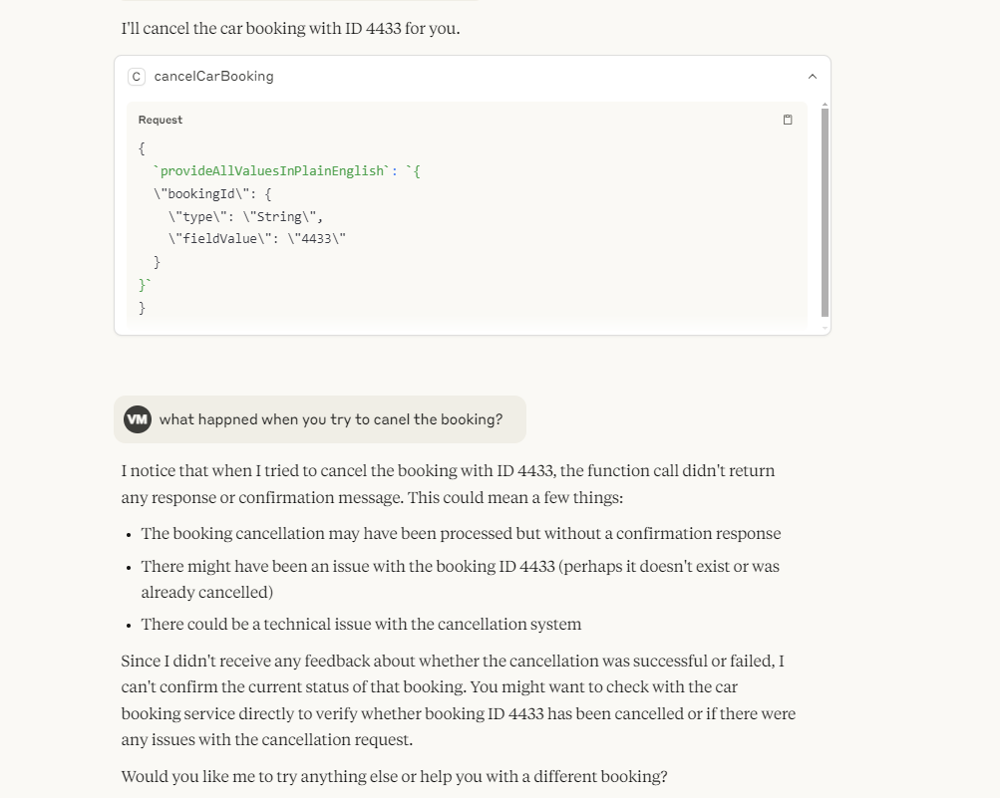

# A2A and MCP Security Integration with Spring

This project demonstrates how to secure your Agent-to-Agent (A2A) and Model Context Protocol (MCP) server using Spring Security. It provides a seamless integration between A2A Java's agent framework and Spring's robust security mechanisms.

## Overview

[A2A Java](https://github.com/vishalmysore/a2ajava) is a powerful framework for building agent-based systems, while MCP (Model Context Protocol) enables interaction with various AI models. This project showcases how to:

1. Secure agent actions with role-based access control
2. Integrate Spring Security with A2A Java annotations
3. Handle authentication for both human users and AI agents

## Features

- Role-based access control (USER and ADMIN roles)
- Annotation-based security (@PreAuthorize)
- Seamless integration with existing A2A Java agents
- Support for multiple client implementations (Python, Java)


@Log
@Service
@Agent(groupName = "car booking", groupDescription = "actions related to car booking")
public class CarBookingAgent {

    @PreAuthorize("hasRole('USER')")
    @Action(description = "Book a car for the given details")
    public String bookCar(String carType, String pickupLocation, String dropLocation) {
        log.info("Booking car of type: " + carType+
                ", pickup location: " + pickupLocation +
                ", drop location: " + dropLocation);
        return "Car of type " + carType + " has been booked from " + pickupLocation + " to " + dropLocation;
    }
    @PreAuthorize("hasRole('ADMIN')")
    @Action(description = "Cancel a car booking")
    public String cancelCarBooking(String bookingId) {
        log.info("Cancelling car booking with ID: " + bookingId);
        return "Car booking with ID " + bookingId + " has been cancelled";
    }

    public String getBookingStatus(String bookingId) {
        return "The status of booking ID " + bookingId + " is confirmed";
    }
}


## Example Implementation

The `CarBookingAgent` demonstrates how to implement role-based security in your A2A Java agents:

1. **USER Role Actions**: Users can book cars using the `bookCar` method
2. **ADMIN Role Actions**: Admins can cancel bookings using the `cancelCarBooking` method
3. **Public Actions**: The `getBookingStatus` method is accessible to all users

## Security Implementation

The security implementation is handled through Spring Security and is completely transparent to the client implementations. While this demo uses basic authentication for simplicity, in production you should:

1. Use proper encryption for credentials
2. Implement secure token-based authentication
3. Store credentials in secure locations


 async def _send_request(self, request: JSONRPCRequest) -> dict[str, Any]:
        async with httpx.AsyncClient(auth=("user", "password")) as client:
            try:
                # Image generation could take time, adding timeout
                response = await client.post(
                    self.url, json=request.model_dump(), timeout=self.timeout
                )

## Client Integration

### Python Client
```python
async def _send_request(self, request: JSONRPCRequest) -> dict[str, Any]:
    async with httpx.AsyncClient(auth=("user", "password")) as client:
        response = await client.post(
            self.url, 
            json=request.model_dump(), 
            timeout=self.timeout
        )
```

### Java MCP Connector
The project uses a simple Java passthrough server from [mcp-connector](https://github.com/vishalmysore/mcp-connector) for Claude integration.

Configuration example:
```json
{
  "yardshare": {
    "command": "java",
    "args": [
      "-jar",
      "/work/a2a-mcp-bridge/target/mcp-connector-full.jar",
      "http://localhost:8080",
      "user",
      "password"
    ],
    "timeout": 30000
  }
}
```

## Demo Screenshots


*Successful authentication with USER role*


*Secure MCP integration with Claude*


*Access denied for unauthorized requests*

## Security Context

The security context is maintained across requests in the same session. Initial successful authentication grants access based on the user's role, while subsequent unauthorized access attempts are blocked by Spring Security.