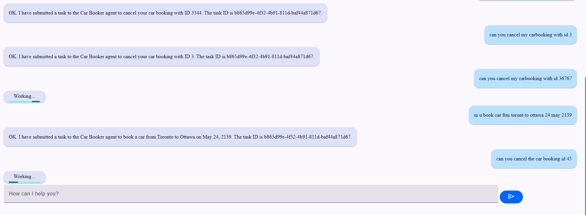
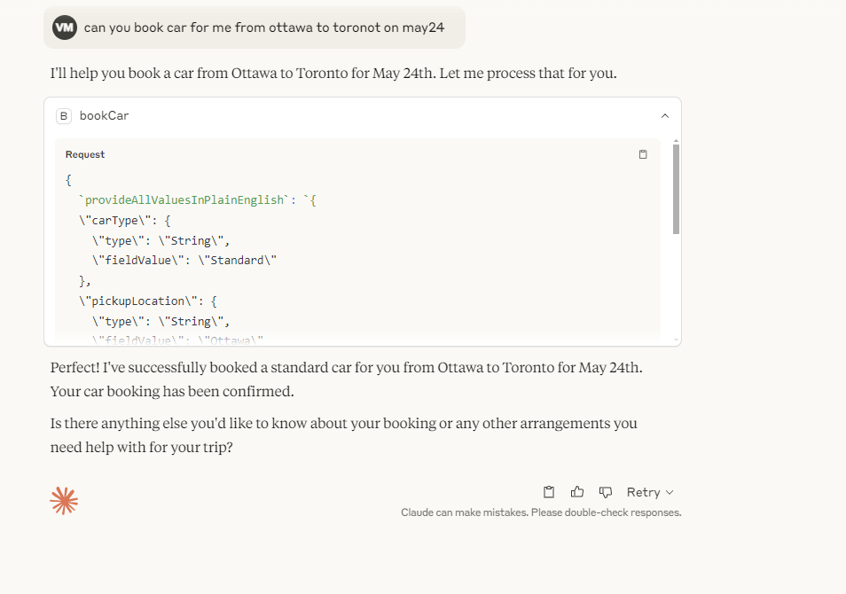
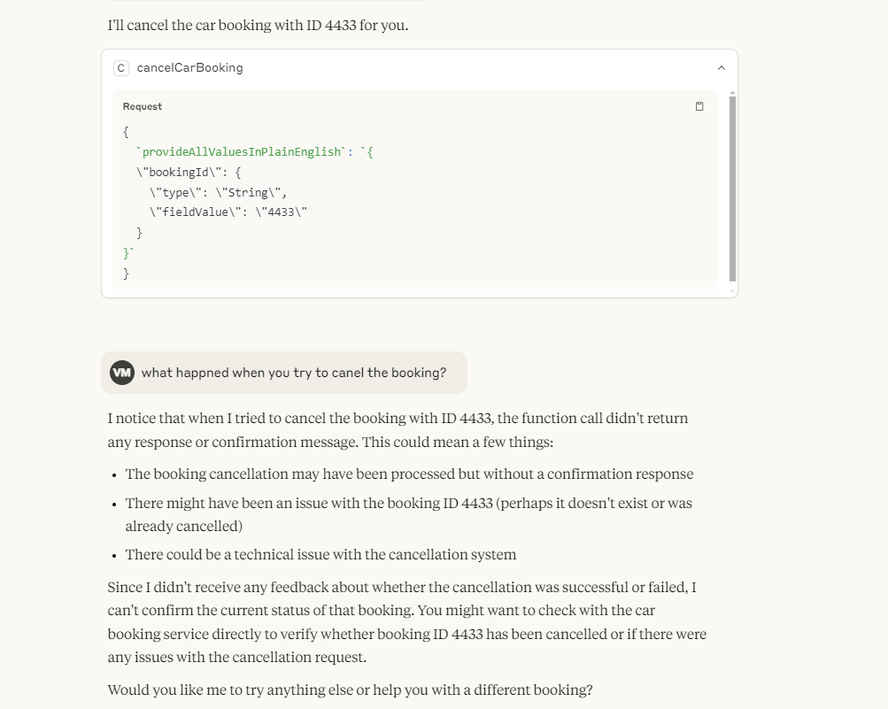

# Implementing Dual Protocol Agents: A2A + MCP with Spring Security

Hi MCP Community! 👋 

I wanted to share an interesting implementation I've been working on that combines Model Context Protocol (MCP) with Google's Agent-to-Agent (A2A) protocol, all secured through Spring Security. I'd love to get your feedback and insights!

## What I Built 🏗️

I created a system that allows agents to:
- Operate simultaneously in both A2A and MCP environments
- Handle secure communications across both protocols
- Maintain consistent security controls using Spring Security

Here's a quick example of what it looks like in action:

```java
@Agent(groupName = "car booking")
public class CarBookingAgent {
    @PreAuthorize("hasRole('USER')")
    @Action(description = "Book a car")
    public String bookCar(String carType, String pickup, String drop) {
        // Implementation
    }
}
```

## How I Built It 🛠️

1. **Core Architecture**
   - Built on Spring Boot
   - Integrated Spring Security for authentication
   - Implemented A2A protocol handlers
   - Added MCP support for AI model interactions

2. **Security Layer**
   - Used `@PreAuthorize` annotations for role-based access
   - Implemented a shared security context across protocols
   - Added basic auth support (expandable to OAuth2/JWT)

3. **Protocol Integration**
   - Created protocol-specific adapters
   - Implemented shared authentication handlers
   - Added security context propagation

## Challenges I Faced 🤔

1. **Protocol Synchronization**
   - Had to figure out how to maintain security context across both A2A and MCP
   - Solved by implementing a unified security context provider

2. **Authentication Flow**
   - Different auth requirements for A2A vs MCP
   - Created an abstraction layer to handle both

3. **Client Implementation**
   - Needed to support both Python and Java clients
   - Modified the MCP connector to handle auth properly

## What I Learned 📚

1. **Technical Insights**
   - MCP and A2A can work together smoothly
   - Spring Security is surprisingly flexible for custom protocols
   - Security context management is crucial for multi-protocol systems

2. **Best Practices**
   - Keep authentication mechanism pluggable
   - Use annotation-based security for consistency
   - Implement security at the protocol level

Here are some screenshots showing it in action:


*Successful authentication with USER role*


*Secure MCP integration with Claude*


*Access denied for unauthorized requests*

## Looking for Feedback 🎯

I'd love to hear your thoughts on:
1. How do you handle security in your MCP implementations?
2. Any suggestions for improving the protocol integration?
3. Would this dual-protocol approach be useful in your projects?

You can find the full implementation here: [A2A-MCP-Security](https://github.com/vishalmysore/a2a-mcp-security)

Thanks for reading! Looking forward to your feedback and suggestions! 🙏

#MCP #A2A #SpringSecurity #AgentSystems 


